## material-design

 -  - `<Icon group="material-design" name="add-alarm-button" />`
 - 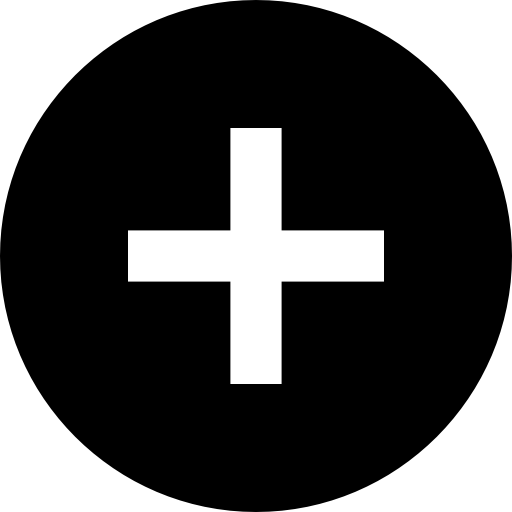 - `<Icon group="material-design" name="add-button-inside-black-circle" />`
 -  - `<Icon group="material-design" name="add-comment-button" />`
 - 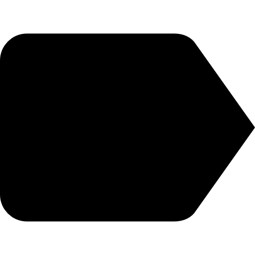 - `<Icon group="material-design" name="add-label-button" />`
 -  - `<Icon group="material-design" name="add-plus-button" />`
 -  - `<Icon group="material-design" name="add-to-queue-button" />`
 - 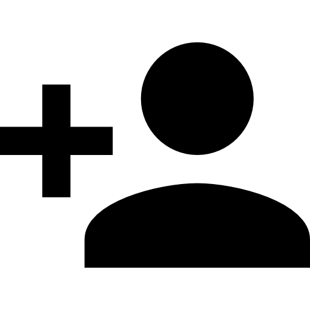 - `<Icon group="material-design" name="add-user-button" />`
 -  - `<Icon group="material-design" name="adjust-button-with-plus-and-minus" />`
 -  - `<Icon group="material-design" name="airplane-mode-on-symbol" />`
 -  - `<Icon group="material-design" name="android-logo-1" />`
 -  - `<Icon group="material-design" name="android-logo" />`
 - 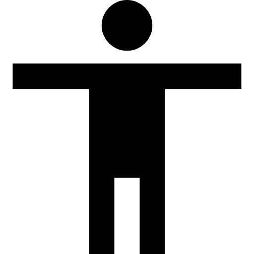 - `<Icon group="material-design" name="apple-accessibility" />`
 - 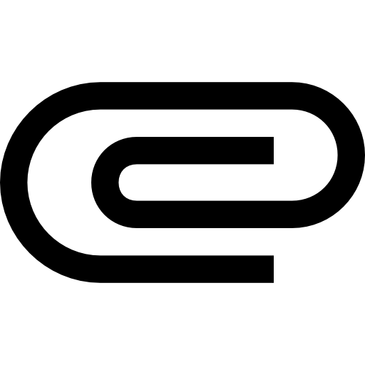 - `<Icon group="material-design" name="attachment-clip" />`
 -  - `<Icon group="material-design" name="auto-white-balance" />`
 -  - `<Icon group="material-design" name="automatic-brightness" />`
 -  - `<Icon group="material-design" name="automatic-flash-symbol" />`
 -  - `<Icon group="material-design" name="back-arrow" />`
 -  - `<Icon group="material-design" name="backspace-arrow" />`
 -  - `<Icon group="material-design" name="bed-quilt" />`
 -  - `<Icon group="material-design" name="been-here-marker" />`
 -  - `<Icon group="material-design" name="birthday-cake" />`
 -  - `<Icon group="material-design" name="black-bubble-speech" />`
 -  - `<Icon group="material-design" name="black-check-box-with-white-check" />`
 -  - `<Icon group="material-design" name="black-check-box" />`
 -  - `<Icon group="material-design" name="black-envelope-email-symbol" />`
 -  - `<Icon group="material-design" name="black-keyboard-with-white-keys" />`
 -  - `<Icon group="material-design" name="black-plane" />`
 -  - `<Icon group="material-design" name="blank-check-box" />`
 -  - `<Icon group="material-design" name="blank-frame" />`
 -  - `<Icon group="material-design" name="blank-square" />`
 -  - `<Icon group="material-design" name="blogger-logo" />`
 - 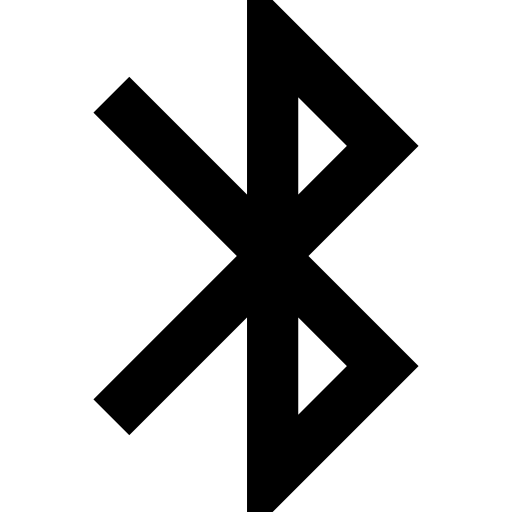 - `<Icon group="material-design" name="blueetooth-logo" />`
 -  - `<Icon group="material-design" name="bluetooth-connected" />`
 - 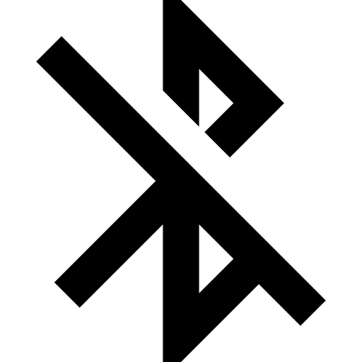 - `<Icon group="material-design" name="bluetooth-disabled-button" />`
 -  - `<Icon group="material-design" name="bluetooth-searching-signal-indicator" />`
 - 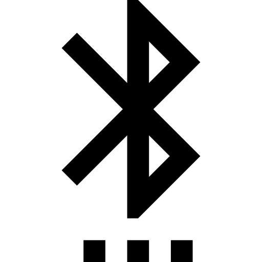 - `<Icon group="material-design" name="bluetooth-settings" />`
 -  - `<Icon group="material-design" name="bluetooth-signal-indicator" />`
 -  - `<Icon group="material-design" name="bookmark-button-1" />`
 -  - `<Icon group="material-design" name="bookmark-button" />`
 - 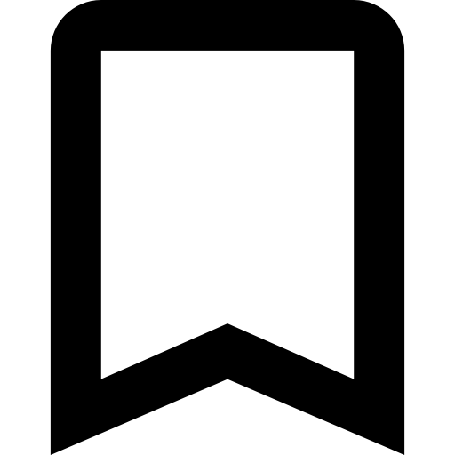 - `<Icon group="material-design" name="bookmark-outline" />`
 -  - `<Icon group="material-design" name="bookmark-ribbon" />`
 -  - `<Icon group="material-design" name="briefcase-download-button-with-downwards-arrow" />`
 -  - `<Icon group="material-design" name="briefcase-with-tick-inside" />`
 - 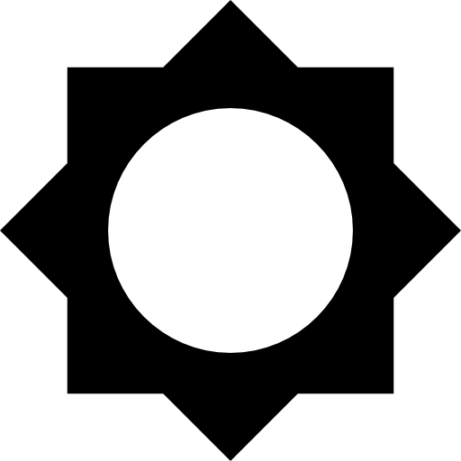 - `<Icon group="material-design" name="brightness-control" />`
 -  - `<Icon group="material-design" name="brochure-with-three-sections" />`
 -  - `<Icon group="material-design" name="bubble-speech-with-three-lines" />`
 -  - `<Icon group="material-design" name="bug-report-button" />`
 -  - `<Icon group="material-design" name="burn-button" />`
 -  - `<Icon group="material-design" name="button-on" />`
 -  - `<Icon group="material-design" name="call-forwarding" />`
 -  - `<Icon group="material-design" name="call-made-right-arrow" />`
 - 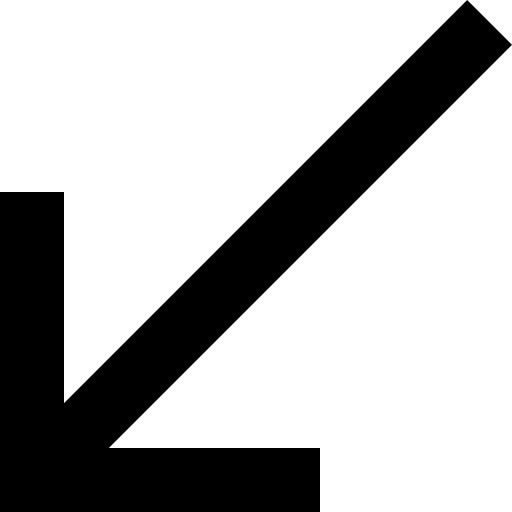 - `<Icon group="material-design" name="call-received-arrow" />`
 -  - `<Icon group="material-design" name="camera-diaphragm" />`
 -  - `<Icon group="material-design" name="camera" />`
 -  - `<Icon group="material-design" name="cancel-button" />`
 - 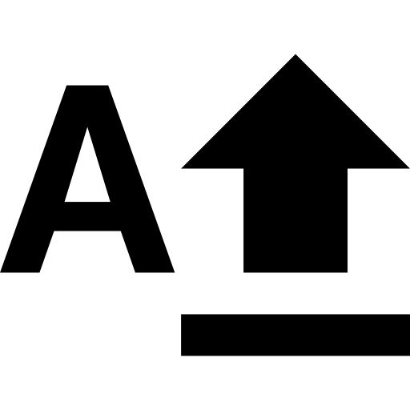 - `<Icon group="material-design" name="caps-lock-button-1" />`
 - 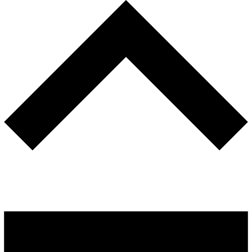 - `<Icon group="material-design" name="caps-lock-button" />`
 - 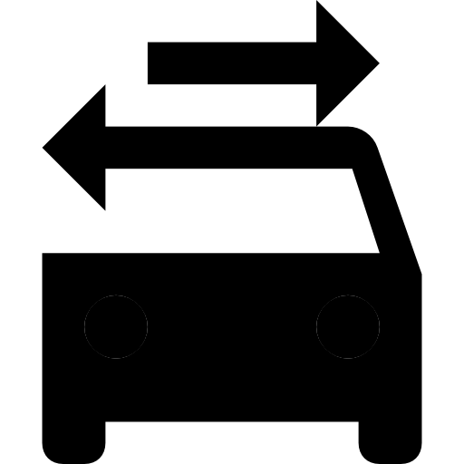 - `<Icon group="material-design" name="car-changing-lanes" />`
 -  - `<Icon group="material-design" name="car-directions" />`
 -  - `<Icon group="material-design" name="car-front" />`
 -  - `<Icon group="material-design" name="cell-phone-high-signal-indicator" />`
 -  - `<Icon group="material-design" name="cell-phone-vibration" />`
 - 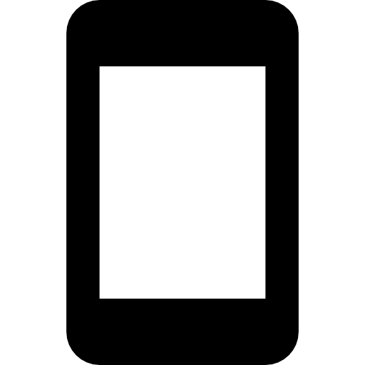 - `<Icon group="material-design" name="cell-phone-with-blank-screen" />`
 -  - `<Icon group="material-design" name="change-power-options" />`
 -  - `<Icon group="material-design" name="chat-bubble" />`
 -  - `<Icon group="material-design" name="chat-bubbles" />`
 -  - `<Icon group="material-design" name="check-box" />`
 -  - `<Icon group="material-design" name="check-symbol" />`
 - 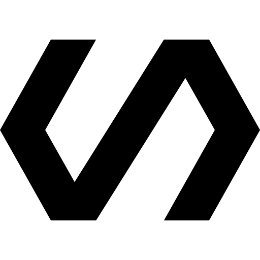 - `<Icon group="material-design" name="chemistry-polymer" />`
 - 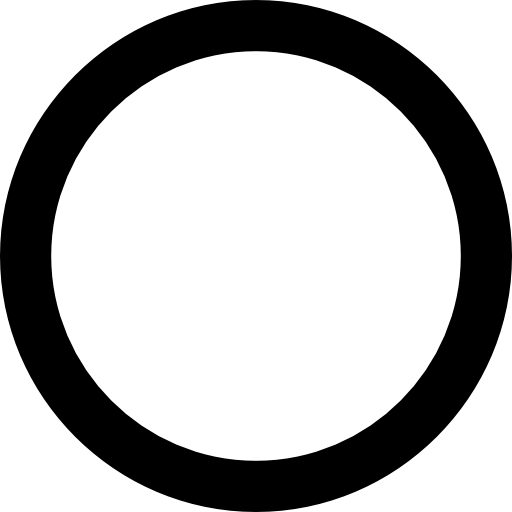 - `<Icon group="material-design" name="circle-outline" />`
 -  - `<Icon group="material-design" name="circle-with-check-symbol" />`
 - 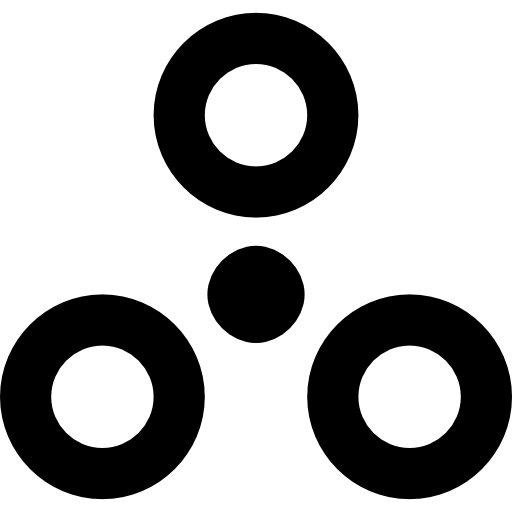 - `<Icon group="material-design" name="circles-extend-button" />`
 -  - `<Icon group="material-design" name="circumference" />`
 - 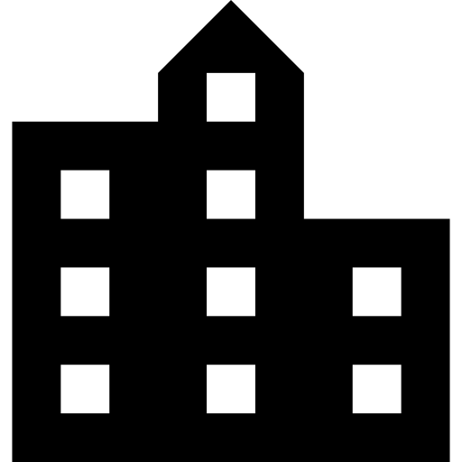 - `<Icon group="material-design" name="city-buildings-silhouette" />`
 -  - `<Icon group="material-design" name="clapperboard-1" />`
 -  - `<Icon group="material-design" name="clapperboard" />`
 -  - `<Icon group="material-design" name="clear-button" />`
 -  - `<Icon group="material-design" name="clipboard-paste-button" />`
 -  - `<Icon group="material-design" name="clock-with-white-face" />`
 -  - `<Icon group="material-design" name="close-button" />`
 -  - `<Icon group="material-design" name="closed-caption-logo" />`
 -  - `<Icon group="material-design" name="cloud-backup-up-arrow" />`
 -  - `<Icon group="material-design" name="cloud-done-symbol" />`
 -  - `<Icon group="material-design" name="cloud-download" />`
 -  - `<Icon group="material-design" name="cloud-off" />`
 -  - `<Icon group="material-design" name="cloud-outline" />`
 -  - `<Icon group="material-design" name="cloud-symbol-inside-a-circle" />`
 -  - `<Icon group="material-design" name="compass-with-white-needles" />`
 - 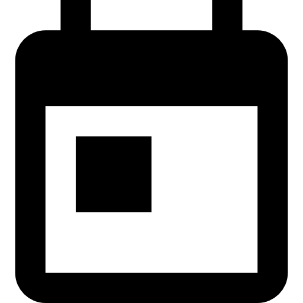 - `<Icon group="material-design" name="connection-indicator" />`
 -  - `<Icon group="material-design" name="copy-content" />`
 -  - `<Icon group="material-design" name="create-group-button" />`
 -  - `<Icon group="material-design" name="create-new-pencil-button" />`
 -  - `<Icon group="material-design" name="credit-card" />`
 - 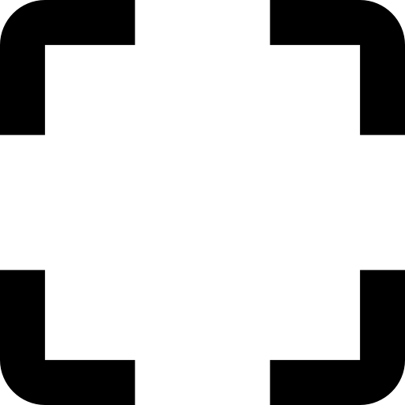 - `<Icon group="material-design" name="crop-button" />`
 -  - `<Icon group="material-design" name="crop-tool-button" />`
 -  - `<Icon group="material-design" name="cut-content-button" />`
 -  - `<Icon group="material-design" name="dark-cloud" />`
 -  - `<Icon group="material-design" name="developer-mode-for-smartphones-and-tablets" />`
 - 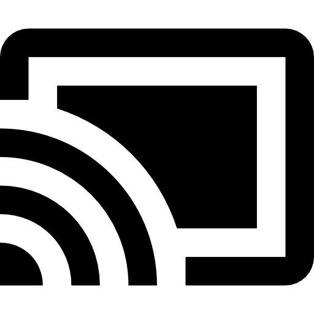 - `<Icon group="material-design" name="device-connected-1" />`
 -  - `<Icon group="material-design" name="device-connected" />`
 - 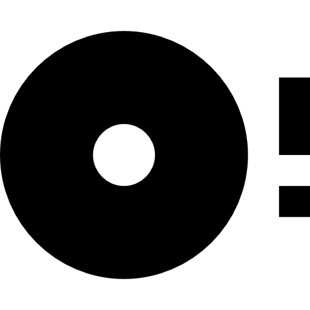 - `<Icon group="material-design" name="disc-is-full" />`
 -  - `<Icon group="material-design" name="do-not-disturb-rounded-sign" />`
 -  - `<Icon group="material-design" name="double-tick-indicator" />`
 -  - `<Icon group="material-design" name="download-button-1" />`
 -  - `<Icon group="material-design" name="download-button" />`
 - 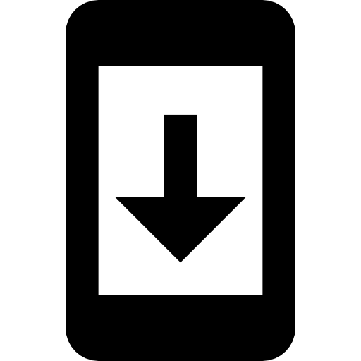 - `<Icon group="material-design" name="download-to-smartphone" />`
 -  - `<Icon group="material-design" name="downwards-arrow-key" />`
 -  - `<Icon group="material-design" name="drafts-evelope-button" />`
 -  - `<Icon group="material-design" name="drop-down-arrow" />`
 -  - `<Icon group="material-design" name="drop-down-round-button" />`
 -  - `<Icon group="material-design" name="drop-up-arrow" />`
 -  - `<Icon group="material-design" name="earth-grid-select-language-button" />`
 -  - `<Icon group="material-design" name="ellipsis" />`
 -  - `<Icon group="material-design" name="email-inbox" />`
 -  - `<Icon group="material-design" name="emoticon-with-happy-face" />`
 -  - `<Icon group="material-design" name="end-call-button" />`
 -  - `<Icon group="material-design" name="enter-arrow" />`
 -  - `<Icon group="material-design" name="exit-to-app-button" />`
 -  - `<Icon group="material-design" name="expand-arrow" />`
 -  - `<Icon group="material-design" name="expand-button" />`
 -  - `<Icon group="material-design" name="facebook-logo" />`
 -  - `<Icon group="material-design" name="failed-sms" />`
 - 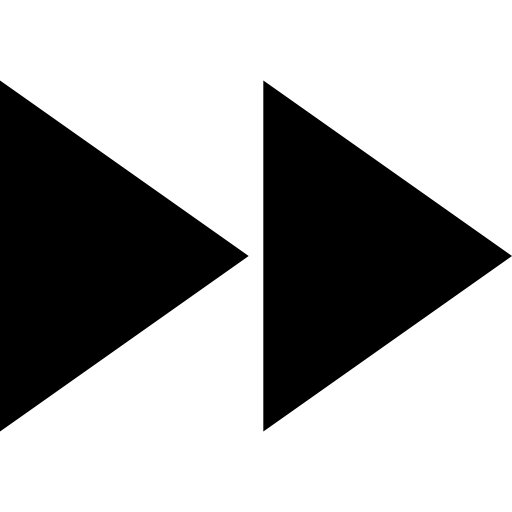 - `<Icon group="material-design" name="fast-forward-button" />`
 -  - `<Icon group="material-design" name="favorite-heart-button" />`
 -  - `<Icon group="material-design" name="favorite-heart-outline-button" />`
 -  - `<Icon group="material-design" name="filled-circle" />`
 -  - `<Icon group="material-design" name="filled-cloud" />`
 -  - `<Icon group="material-design" name="filled-speaker-with-white-details" />`
 - 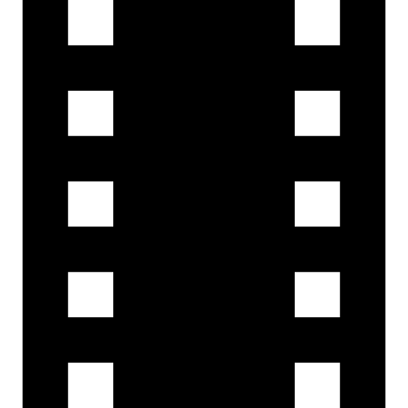 - `<Icon group="material-design" name="film-roll" />`
 -  - `<Icon group="material-design" name="filter-results-button" />`
 -  - `<Icon group="material-design" name="flash-off" />`
 - 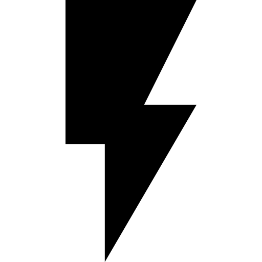 - `<Icon group="material-design" name="flash-on-indicator" />`
 -  - `<Icon group="material-design" name="folder-symbol" />`
 -  - `<Icon group="material-design" name="forward-arrow" />`
 - 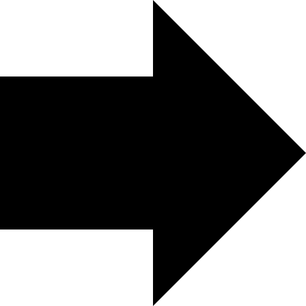 - `<Icon group="material-design" name="forward-right-arrow-button" />`
 -  - `<Icon group="material-design" name="framed-portrait" />`
 -  - `<Icon group="material-design" name="front-bus" />`
 -  - `<Icon group="material-design" name="front-car" />`
 -  - `<Icon group="material-design" name="front-store" />`
 -  - `<Icon group="material-design" name="full-screen-exit" />`
 -  - `<Icon group="material-design" name="gamepad-1" />`
 -  - `<Icon group="material-design" name="gamepad" />`
 -  - `<Icon group="material-design" name="get-directions-button" />`
 -  - `<Icon group="material-design" name="gmail-logo" />`
 -  - `<Icon group="material-design" name="go-back-left-arrow" />`
 -  - `<Icon group="material-design" name="good-mood-emoticon" />`
 - 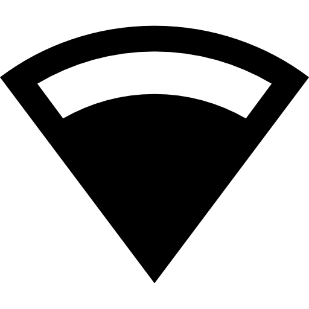 - `<Icon group="material-design" name="good-wifi-signal-with-three-bars" />`
 -  - `<Icon group="material-design" name="google-apps-script-logo" />`
 - 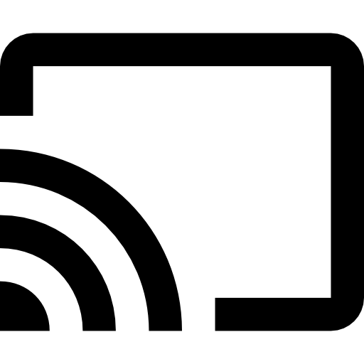 - `<Icon group="material-design" name="google-cast-logo" />`
 - 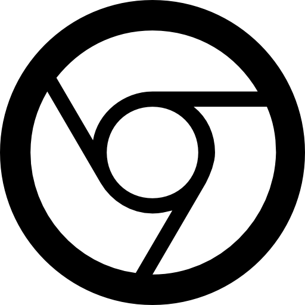 - `<Icon group="material-design" name="google-chrome-logo-filled-with-white-colour" />`
 -  - `<Icon group="material-design" name="google-drive-document" />`
 -  - `<Icon group="material-design" name="google-drive-file" />`
 -  - `<Icon group="material-design" name="google-drive-folder-symbol" />`
 -  - `<Icon group="material-design" name="google-drive-fusion-tables-logo" />`
 -  - `<Icon group="material-design" name="google-drive-image" />`
 -  - `<Icon group="material-design" name="google-drive-logo" />`
 -  - `<Icon group="material-design" name="google-drive-pdf-file" />`
 -  - `<Icon group="material-design" name="google-drive-presentation" />`
 -  - `<Icon group="material-design" name="google-drive-spreadsheet" />`
 -  - `<Icon group="material-design" name="google-glass-logo" />`
 -  - `<Icon group="material-design" name="google-hangouts-logo" />`
 -  - `<Icon group="material-design" name="google-hangouts-turn-video-off" />`
 -  - `<Icon group="material-design" name="google-plus-logo-on-black-background" />`
 -  - `<Icon group="material-design" name="google-plus-logo" />`
 -  - `<Icon group="material-design" name="google-plus-party-mode" />`
 -  - `<Icon group="material-design" name="google-symbol" />`
 -  - `<Icon group="material-design" name="gps-fixed-indicator" />`
 -  - `<Icon group="material-design" name="gps-location-disabled" />`
 -  - `<Icon group="material-design" name="gps-location-symbol" />`
 -  - `<Icon group="material-design" name="gps-off" />`
 -  - `<Icon group="material-design" name="graduate-cap" />`
 -  - `<Icon group="material-design" name="half-filled-rating-star" />`
 -  - `<Icon group="material-design" name="hangouts-videocall-button" />`
 -  - `<Icon group="material-design" name="headset-with-microphone" />`
 -  - `<Icon group="material-design" name="headset" />`
 -  - `<Icon group="material-design" name="help-button-speech-bubble-with-question-mark" />`
 -  - `<Icon group="material-design" name="help-round-button" />`
 -  - `<Icon group="material-design" name="hide-keyboard-button" />`
 -  - `<Icon group="material-design" name="high-quality-button" />`
 -  - `<Icon group="material-design" name="high-signal-indicator" />`
 -  - `<Icon group="material-design" name="high-wifi-signal-indicator" />`
 -  - `<Icon group="material-design" name="history-clock-button" />`
 -  - `<Icon group="material-design" name="home-button" />`
 -  - `<Icon group="material-design" name="horizontal-line-remove-button" />`
 -  - `<Icon group="material-design" name="hotel-with-three-floors" />`
 -  - `<Icon group="material-design" name="https-symbol" />`
 -  - `<Icon group="material-design" name="import-export-arrows" />`
 -  - `<Icon group="material-design" name="insert-picture-button" />`
 -  - `<Icon group="material-design" name="instagram-logo" />`
 - 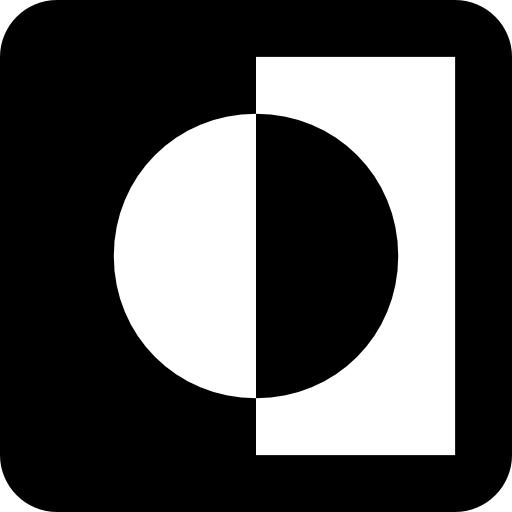 - `<Icon group="material-design" name="invert-colors-button" />`
 -  - `<Icon group="material-design" name="keyboard-left-arrow-button" />`
 -  - `<Icon group="material-design" name="keyboard-right-arrow-button-1" />`
 -  - `<Icon group="material-design" name="keyboard-right-arrow-button" />`
 -  - `<Icon group="material-design" name="label-right-arrow-outline" />`
 -  - `<Icon group="material-design" name="landscape-with-mountains" />`
 - 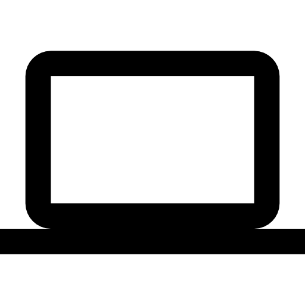 - `<Icon group="material-design" name="laptop-outline" />`
 - 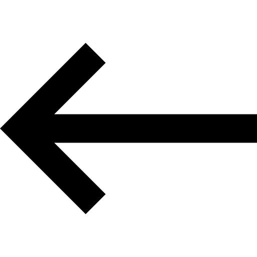 - `<Icon group="material-design" name="left-arrow-key-1" />`
 -  - `<Icon group="material-design" name="left-arrow-key" />`
 - 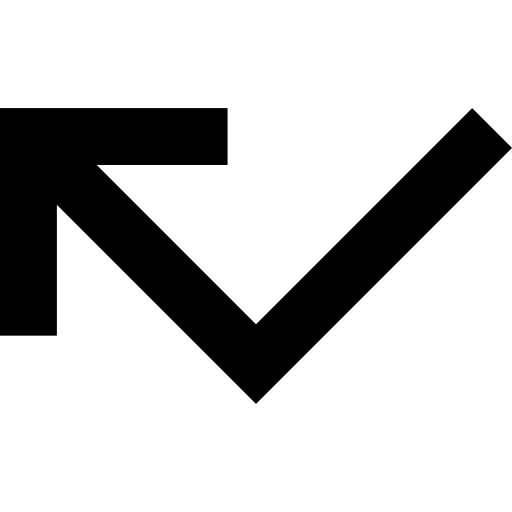 - `<Icon group="material-design" name="left-arrow-missed-call" />`
 -  - `<Icon group="material-design" name="light-bulb-on" />`
 - 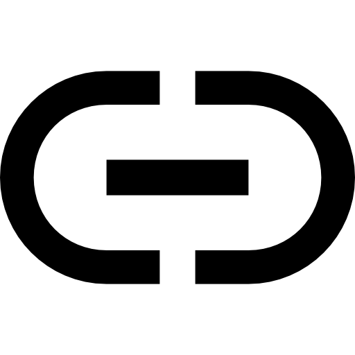 - `<Icon group="material-design" name="link-button" />`
 -  - `<Icon group="material-design" name="linkedin-logo" />`
 - 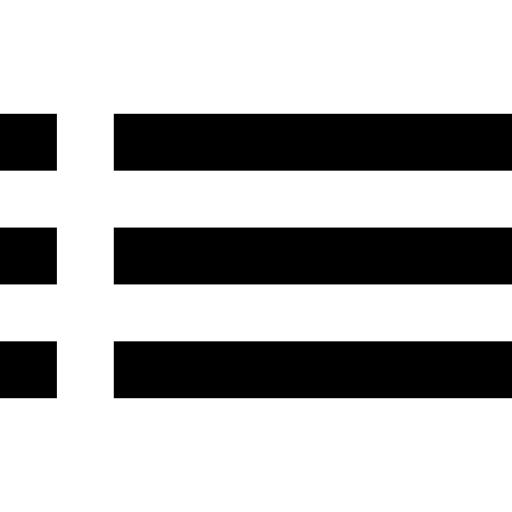 - `<Icon group="material-design" name="list-button-with-3-elements" />`
 -  - `<Icon group="material-design" name="list-of-three-elements-on-black-background" />`
 - 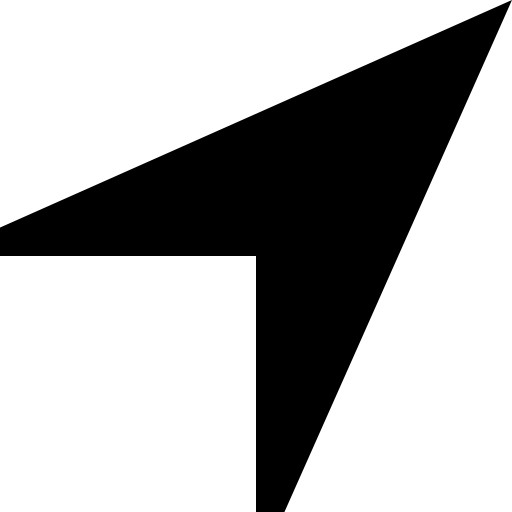 - `<Icon group="material-design" name="location-arrow" />`
 -  - `<Icon group="material-design" name="locked-padlock-outline" />`
 -  - `<Icon group="material-design" name="locked-padlock" />`
 -  - `<Icon group="material-design" name="low-signal-indicator" />`
 -  - `<Icon group="material-design" name="magic-wand-auto-fix-button" />`
 -  - `<Icon group="material-design" name="man-cycling" />`
 -  - `<Icon group="material-design" name="man-walking-directions-button" />`
 -  - `<Icon group="material-design" name="map-placeholder" />`
 -  - `<Icon group="material-design" name="map-symbol" />`
 -  - `<Icon group="material-design" name="mark-as-favorite-star" />`
 - 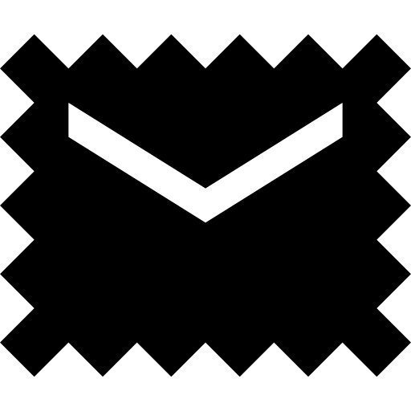 - `<Icon group="material-design" name="mark-as-unread-envelope-button" />`
 - 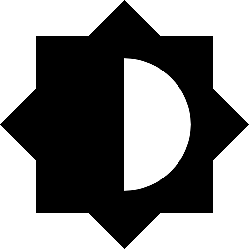 - `<Icon group="material-design" name="medium-brightness-cogwheel" />`
 - 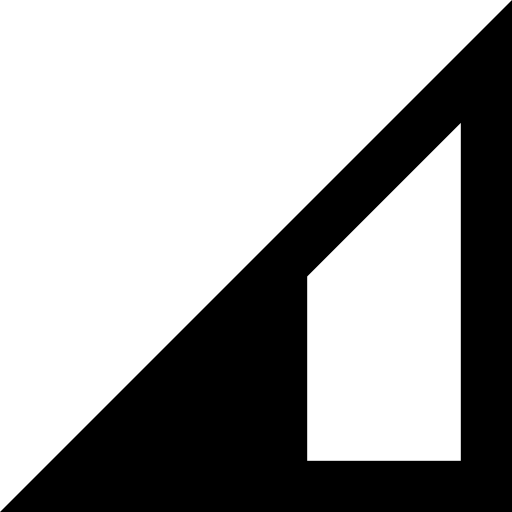 - `<Icon group="material-design" name="medium-signal" />`
 -  - `<Icon group="material-design" name="medium-wifi-signal-with-two-bars" />`
 -  - `<Icon group="material-design" name="memory-chip" />`
 -  - `<Icon group="material-design" name="menu-button" />`
 -  - `<Icon group="material-design" name="merge-calls-arrow" />`
 -  - `<Icon group="material-design" name="microphone-of-voice" />`
 -  - `<Icon group="material-design" name="microphone-voice-button" />`
 -  - `<Icon group="material-design" name="microsoft-excel-logo" />`
 -  - `<Icon group="material-design" name="microsoft-word-logo" />`
 -  - `<Icon group="material-design" name="missed-call-phone-receiver-with-left-arrow" />`
 -  - `<Icon group="material-design" name="mountain-range-on-black-background" />`
 -  - `<Icon group="material-design" name="mountain-range" />`
 -  - `<Icon group="material-design" name="mountains-inside-a-circle" />`
 -  - `<Icon group="material-design" name="mouse-filled-tool" />`
 -  - `<Icon group="material-design" name="move-window" />`
 - 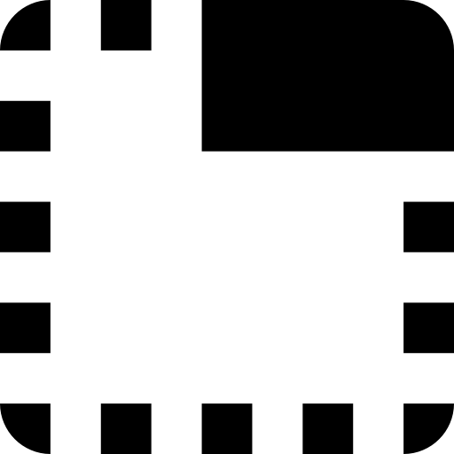 - `<Icon group="material-design" name="new-tab-button" />`
 -  - `<Icon group="material-design" name="new-tab" />`
 -  - `<Icon group="material-design" name="nfc-near-field-communication" />`
 -  - `<Icon group="material-design" name="notifications-bell-button" />`
 -  - `<Icon group="material-design" name="notifications-button" />`
 -  - `<Icon group="material-design" name="notifications-silenced" />`
 -  - `<Icon group="material-design" name="pages-of-google-plus" />`
 -  - `<Icon group="material-design" name="painter-palette" />`
 -  - `<Icon group="material-design" name="panoramic-mountain-photography" />`
 -  - `<Icon group="material-design" name="parking-sign" />`
 -  - `<Icon group="material-design" name="pause-button" />`
 -  - `<Icon group="material-design" name="phone-call-button" />`
 -  - `<Icon group="material-design" name="phone-locked" />`
 -  - `<Icon group="material-design" name="phone-paused-indicator" />`
 -  - `<Icon group="material-design" name="phone-receiver-with-bluetooth-sign" />`
 -  - `<Icon group="material-design" name="phone-settings" />`
 -  - `<Icon group="material-design" name="phone-working-indicator" />`
 - 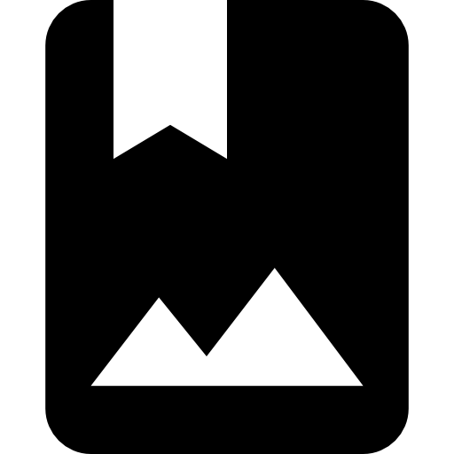 - `<Icon group="material-design" name="photo-album" />`
 -  - `<Icon group="material-design" name="photo-frame" />`
 - 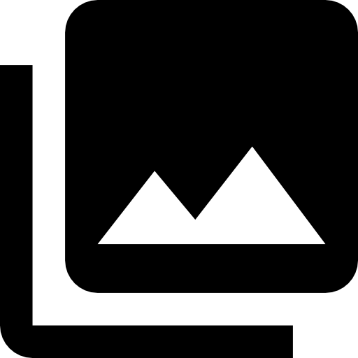 - `<Icon group="material-design" name="photo-library" />`
 - 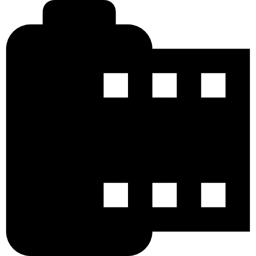 - `<Icon group="material-design" name="photographic-film-roll" />`
 -  - `<Icon group="material-design" name="pinterest-logo" />`
 -  - `<Icon group="material-design" name="planet-earth" />`
 -  - `<Icon group="material-design" name="play-arrow" />`
 -  - `<Icon group="material-design" name="play-button-inside-a-circle" />`
 -  - `<Icon group="material-design" name="play-next-button" />`
 -  - `<Icon group="material-design" name="play-rounded-button" />`
 -  - `<Icon group="material-design" name="play-slideshow-button" />`
 -  - `<Icon group="material-design" name="plus-one" />`
 -  - `<Icon group="material-design" name="poll-symbol-on-black-square-with-rounded-corners" />`
 -  - `<Icon group="material-design" name="power-connection-indicator" />`
 -  - `<Icon group="material-design" name="previous-track" />`
 -  - `<Icon group="material-design" name="printer-printing-document" />`
 - 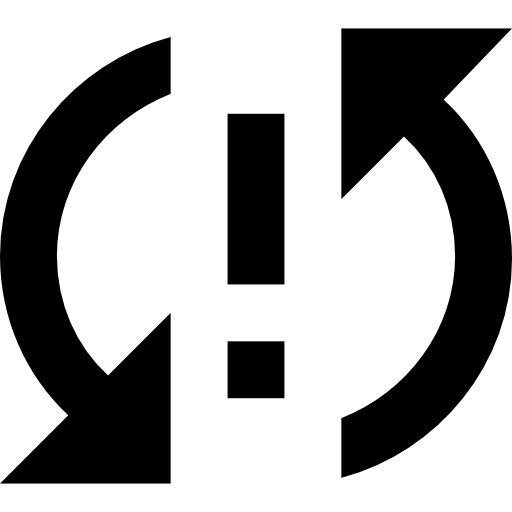 - `<Icon group="material-design" name="problems-with-synchronization" />`
 - 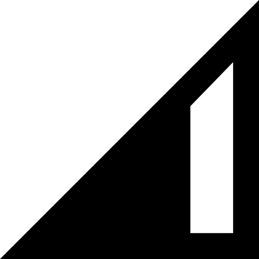 - `<Icon group="material-design" name="progress-indicator" />`
 -  - `<Icon group="material-design" name="public-transport-subway" />`
 -  - `<Icon group="material-design" name="public-transport-train-directions" />`
 - 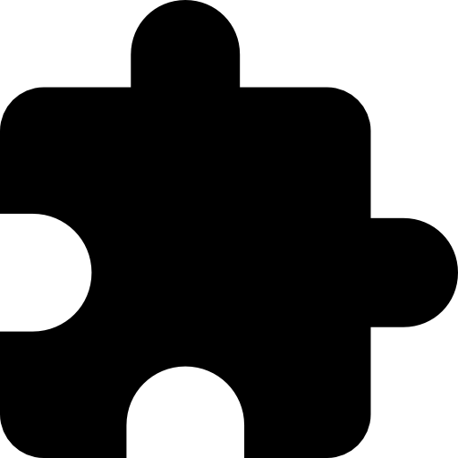 - `<Icon group="material-design" name="puzzle-piece-plugin" />`
 -  - `<Icon group="material-design" name="radio-on-button" />`
 - 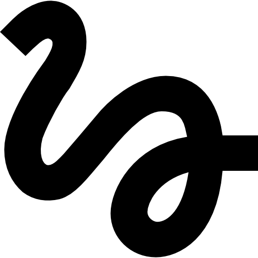 - `<Icon group="material-design" name="random-line" />`
 -  - `<Icon group="material-design" name="rate-star-button" />`
 -  - `<Icon group="material-design" name="read-more-left-arrow-button" />`
 -  - `<Icon group="material-design" name="receipt" />`
 -  - `<Icon group="material-design" name="record-voice-microphone-button" />`
 -  - `<Icon group="material-design" name="refresh-button-1" />`
 -  - `<Icon group="material-design" name="refresh-button" />`
 - 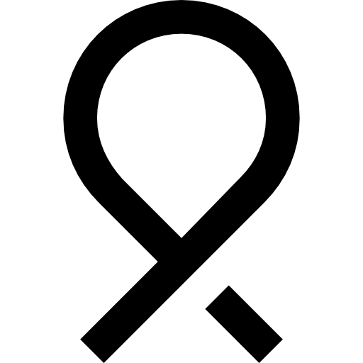 - `<Icon group="material-design" name="reminder-bow" />`
 -  - `<Icon group="material-design" name="replay-arrow" />`
 - 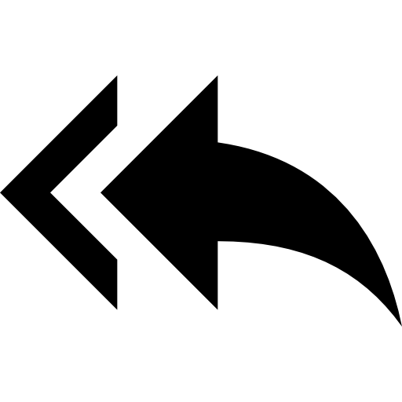 - `<Icon group="material-design" name="reply-all-button" />`
 -  - `<Icon group="material-design" name="report-symbol" />`
 - 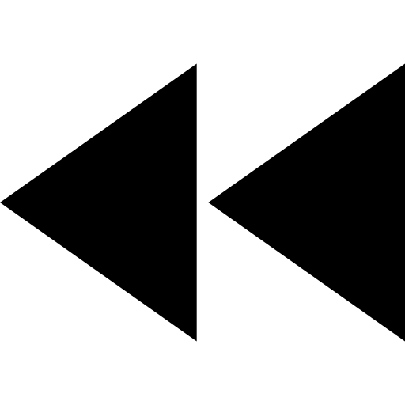 - `<Icon group="material-design" name="rewind-button" />`
 -  - `<Icon group="material-design" name="right-arrow-forward" />`
 - 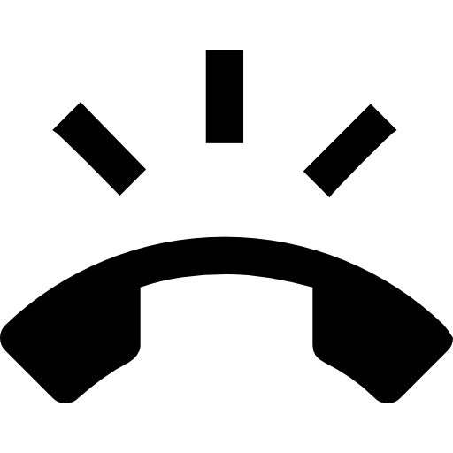 - `<Icon group="material-design" name="ring-volume-control-button" />`
 -  - `<Icon group="material-design" name="rotate-to-left-button" />`
 - 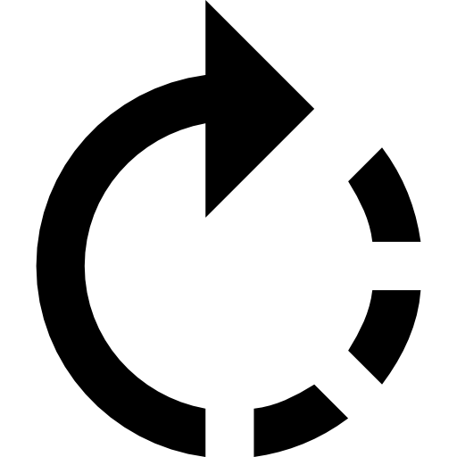 - `<Icon group="material-design" name="rotate-to-right-button" />`
 -  - `<Icon group="material-design" name="round-account-button-with-user-inside" />`
 -  - `<Icon group="material-design" name="round-add-button" />`
 - 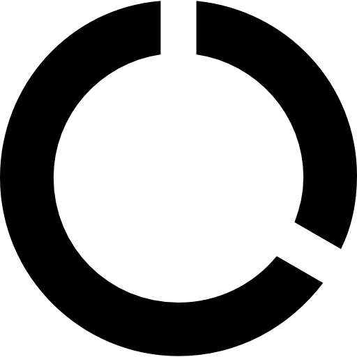 - `<Icon group="material-design" name="round-data-usage-symbol" />`
 -  - `<Icon group="material-design" name="round-delete-button" />`
 -  - `<Icon group="material-design" name="round-error-symbol" />`
 -  - `<Icon group="material-design" name="round-info-button" />`
 -  - `<Icon group="material-design" name="round-pause-button" />`
 -  - `<Icon group="material-design" name="round-remove-button" />`
 -  - `<Icon group="material-design" name="round-rgb-button" />`
 -  - `<Icon group="material-design" name="rounded-add-button-1" />`
 -  - `<Icon group="material-design" name="rounded-add-button" />`
 - 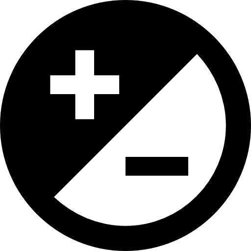 - `<Icon group="material-design" name="rounded-adjust-button-with-plus-and-minus" />`
 -  - `<Icon group="material-design" name="rounded-block-sign" />`
 -  - `<Icon group="material-design" name="rounded-info-button" />`
 -  - `<Icon group="material-design" name="rounded-pause-button" />`
 -  - `<Icon group="material-design" name="rounded-remove-button" />`
 -  - `<Icon group="material-design" name="rubbish-bin-delete-button" />`
 -  - `<Icon group="material-design" name="save-button" />`
 -  - `<Icon group="material-design" name="schedule-button" />`
 -  - `<Icon group="material-design" name="screen-locked-1" />`
 -  - `<Icon group="material-design" name="screen-locked" />`
 -  - `<Icon group="material-design" name="screen-rotation-button" />`
 -  - `<Icon group="material-design" name="screen-rotation-lock-button" />`
 - 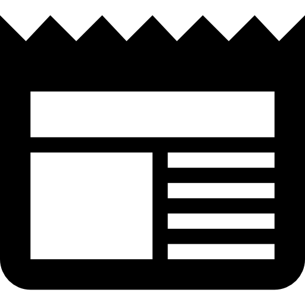 - `<Icon group="material-design" name="screen-with-news-sections" />`
 -  - `<Icon group="material-design" name="screen-with-rounded-corners" />`
 - 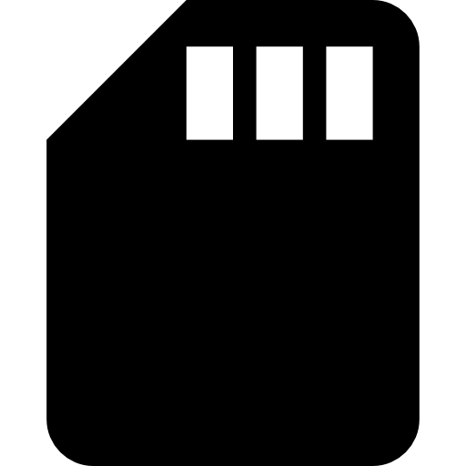 - `<Icon group="material-design" name="sd-card-1" />`
 -  - `<Icon group="material-design" name="sd-card" />`
 -  - `<Icon group="material-design" name="searching-location-gps-indicator" />`
 -  - `<Icon group="material-design" name="searching-magnifying-glass" />`
 - 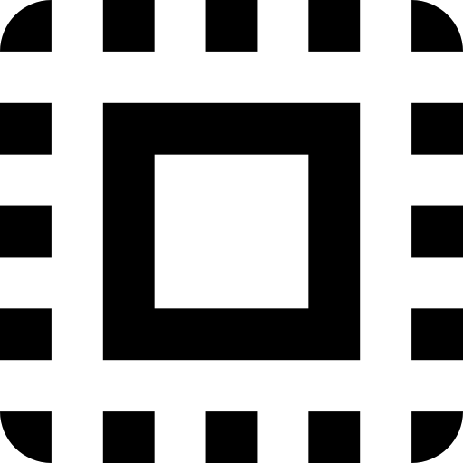 - `<Icon group="material-design" name="select-all" />`
 - 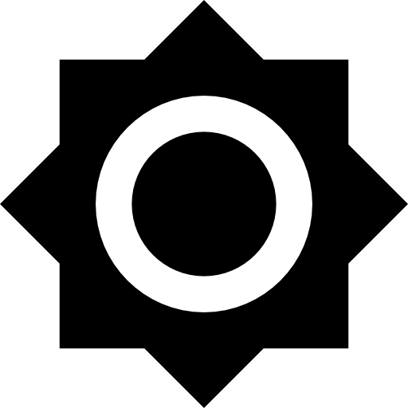 - `<Icon group="material-design" name="select-brightness-button" />`
 -  - `<Icon group="material-design" name="send-button" />`
 -  - `<Icon group="material-design" name="send-to-back-button" />`
 -  - `<Icon group="material-design" name="send-to-front-button" />`
 -  - `<Icon group="material-design" name="server-rack-with-three-levels" />`
 -  - `<Icon group="material-design" name="set-alarm" />`
 -  - `<Icon group="material-design" name="set-timer-button" />`
 -  - `<Icon group="material-design" name="settings-cogwheel-button" />`
 - 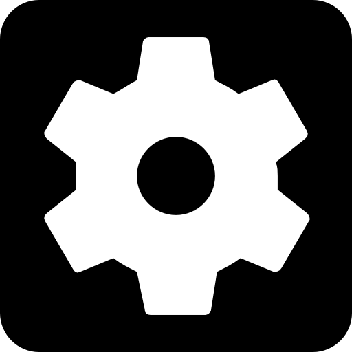 - `<Icon group="material-design" name="settings-cogwheel-inside-black-square" />`
 -  - `<Icon group="material-design" name="share-button" />`
 -  - `<Icon group="material-design" name="shared-folder" />`
 -  - `<Icon group="material-design" name="shining-rectangular-object" />`
 -  - `<Icon group="material-design" name="shining-sun" />`
 -  - `<Icon group="material-design" name="shopping-basket-button" />`
 -  - `<Icon group="material-design" name="shopping-cart" />`
 -  - `<Icon group="material-design" name="show-apps-button" />`
 -  - `<Icon group="material-design" name="show-less-fold-button" />`
 -  - `<Icon group="material-design" name="show-menu-button" />`
 -  - `<Icon group="material-design" name="show-more-button-with-three-dots" />`
 -  - `<Icon group="material-design" name="show-more-button" />`
 -  - `<Icon group="material-design" name="shuffle-mode-arrows" />`
 -  - `<Icon group="material-design" name="sim-card-problem" />`
 - 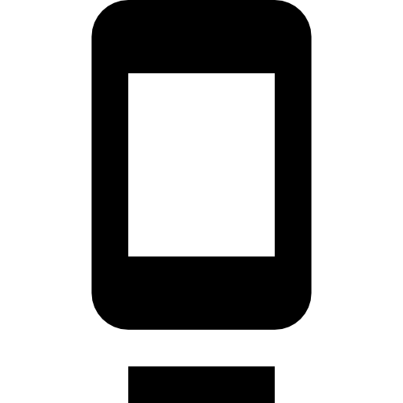 - `<Icon group="material-design" name="smartphone-dock" />`
 - 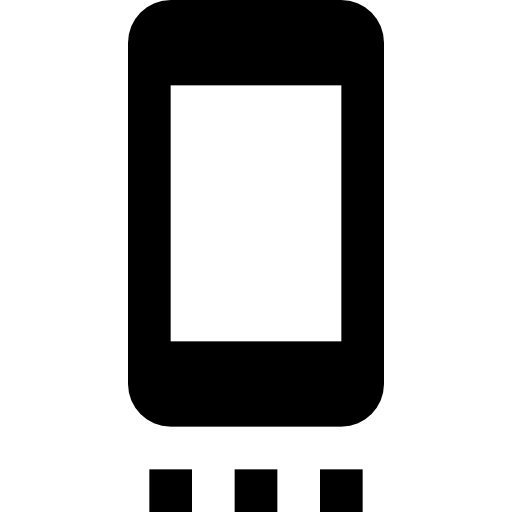 - `<Icon group="material-design" name="smartphone-with-three-buttons" />`
 -  - `<Icon group="material-design" name="sms-bubble-speech" />`
 -  - `<Icon group="material-design" name="sms-speech-bubble" />`
 -  - `<Icon group="material-design" name="snake-game" />`
 -  - `<Icon group="material-design" name="sort-button-with-three-lines" />`
 -  - `<Icon group="material-design" name="speech-bubble-with-mountains-inside" />`
 - 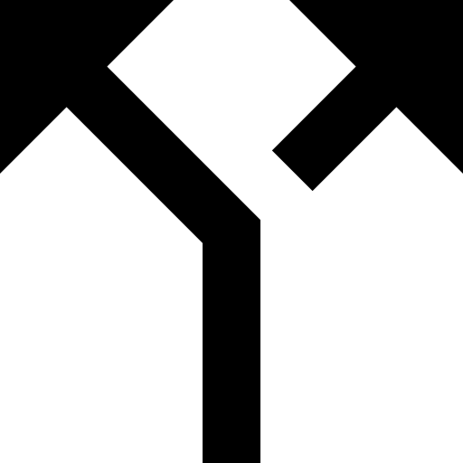 - `<Icon group="material-design" name="split-call-arrows" />`
 -  - `<Icon group="material-design" name="square-add-button" />`
 -  - `<Icon group="material-design" name="stop-button" />`
 -  - `<Icon group="material-design" name="swap-horizontal-orientation-arrows" />`
 - 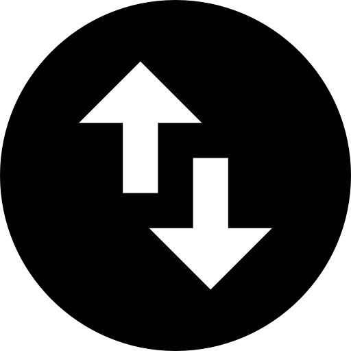 - `<Icon group="material-design" name="swap-vertical-orientation-arrows" />`
 -  - `<Icon group="material-design" name="switch-camera-button" />`
 -  - `<Icon group="material-design" name="switch-to-full-screen-button" />`
 -  - `<Icon group="material-design" name="switch-vertical-orientation-arrows" />`
 - 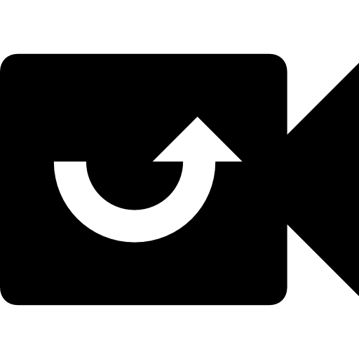 - `<Icon group="material-design" name="switch-video-on" />`
 -  - `<Icon group="material-design" name="synchronization-arrows" />`
 -  - `<Icon group="material-design" name="synchronization-button-with-two-arrows" />`
 -  - `<Icon group="material-design" name="synchronization-problem" />`
 - 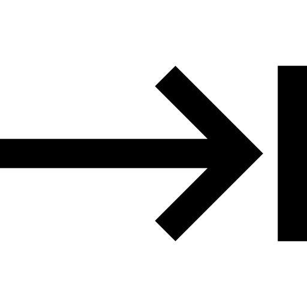 - `<Icon group="material-design" name="tab-symbol" />`
 -  - `<Icon group="material-design" name="tablet-with-blank-screen" />`
 - 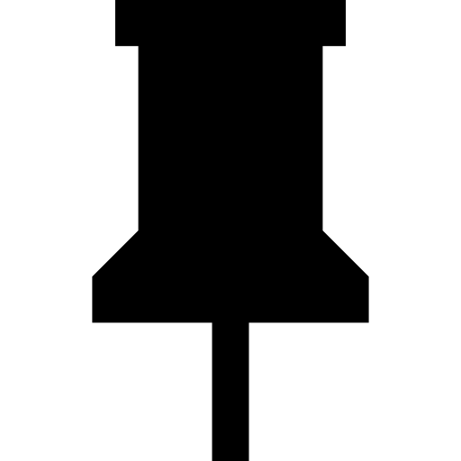 - `<Icon group="material-design" name="tack-save-button" />`
 -  - `<Icon group="material-design" name="tag-button-with-happy-face" />`
 -  - `<Icon group="material-design" name="telephone-keypad-with-ten-keys" />`
 - 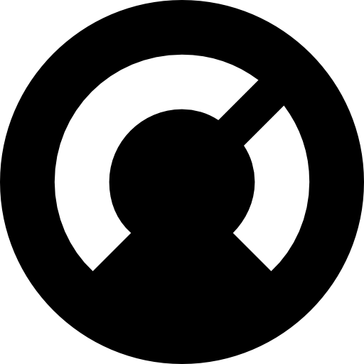 - `<Icon group="material-design" name="thermostat-temperature-wheel" />`
 -  - `<Icon group="material-design" name="three-columns-layout" />`
 -  - `<Icon group="material-design" name="three-dots-more-indicator" />`
 -  - `<Icon group="material-design" name="thumb-down-button" />`
 -  - `<Icon group="material-design" name="thumb-up-button" />`
 -  - `<Icon group="material-design" name="tick-inside-circle" />`
 -  - `<Icon group="material-design" name="time-lapse" />`
 - 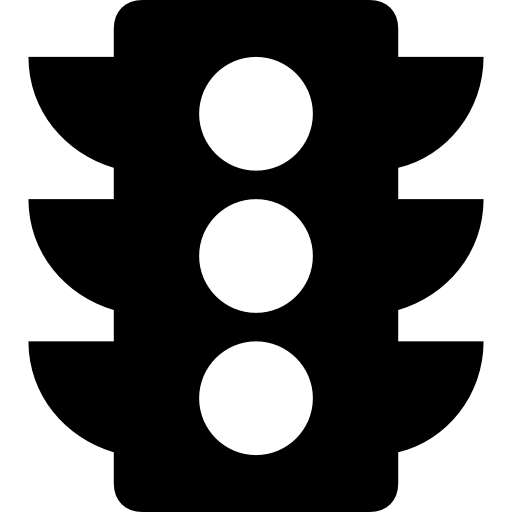 - `<Icon group="material-design" name="traffic-light" />`
 -  - `<Icon group="material-design" name="train-public-transport" />`
 -  - `<Icon group="material-design" name="tumblr-logo" />`
 -  - `<Icon group="material-design" name="turn-airplane-mode-off" />`
 -  - `<Icon group="material-design" name="turn-microphone-off-button" />`
 -  - `<Icon group="material-design" name="turn-notifications-off-button" />`
 -  - `<Icon group="material-design" name="turn-notifications-on-button" />`
 -  - `<Icon group="material-design" name="turn-synchronization-off" />`
 -  - `<Icon group="material-design" name="turn-video-off-button" />`
 -  - `<Icon group="material-design" name="turn-visibility-off-button" />`
 -  - `<Icon group="material-design" name="twitter-logo-on-black-background" />`
 - 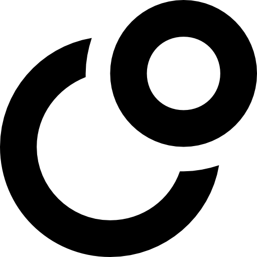 - `<Icon group="material-design" name="two-circles-one-inside-the-other" />`
 -  - `<Icon group="material-design" name="two-men" />`
 - 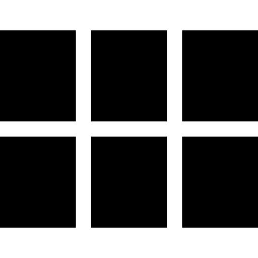 - `<Icon group="material-design" name="two-rows-and-three-columns-layout" />`
 -  - `<Icon group="material-design" name="underline-button" />`
 -  - `<Icon group="material-design" name="underline-text-button" />`
 -  - `<Icon group="material-design" name="undo-button" />`
 -  - `<Icon group="material-design" name="unlocked-padlock" />`
 -  - `<Icon group="material-design" name="up-arrow-key" />`
 - 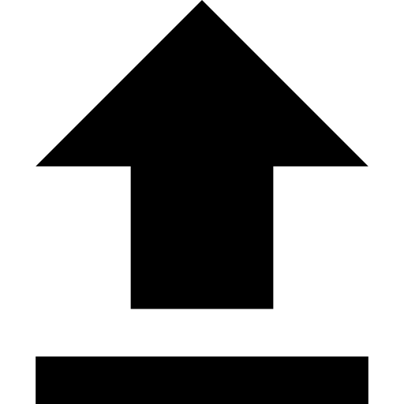 - `<Icon group="material-design" name="upload-button" />`
 -  - `<Icon group="material-design" name="upload-to-cloud-button" />`
 -  - `<Icon group="material-design" name="usb-symbol" />`
 - 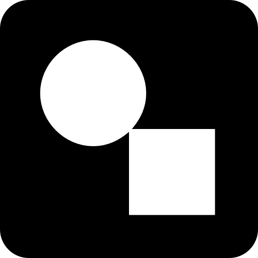 - `<Icon group="material-design" name="user-account-box-1" />`
 -  - `<Icon group="material-design" name="user-account-box" />`
 -  - `<Icon group="material-design" name="user-inside-bubble-speech" />`
 -  - `<Icon group="material-design" name="user-outline" />`
 -  - `<Icon group="material-design" name="user-shape" />`
 -  - `<Icon group="material-design" name="users-social-symbol" />`
 -  - `<Icon group="material-design" name="verification-mark" />`
 -  - `<Icon group="material-design" name="videocall-button" />`
 -  - `<Icon group="material-design" name="videocam-filled-tool" />`
 -  - `<Icon group="material-design" name="view-list-button" />`
 -  - `<Icon group="material-design" name="virtual-private-network-vpn-symbol" />`
 -  - `<Icon group="material-design" name="visibility-button" />`
 -  - `<Icon group="material-design" name="voice-message-microphone-button" />`
 -  - `<Icon group="material-design" name="voicemail" />`
 -  - `<Icon group="material-design" name="volume-down-indicator" />`
 - 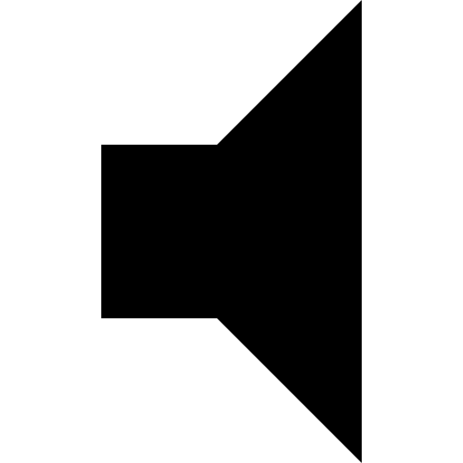 - `<Icon group="material-design" name="volume-muted" />`
 -  - `<Icon group="material-design" name="volume-off-indicator" />`
 -  - `<Icon group="material-design" name="volume-up-indicator" />`
 - 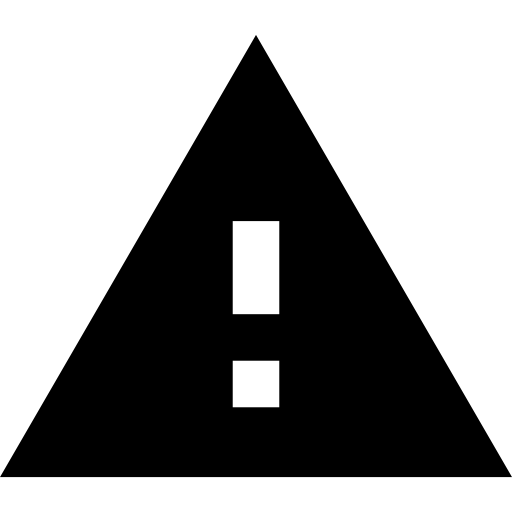 - `<Icon group="material-design" name="warning-sign" />`
 - 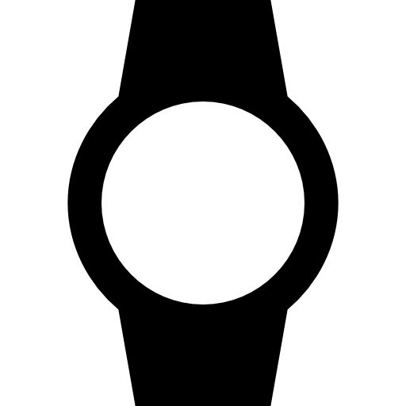 - `<Icon group="material-design" name="watch-with-blank-face" />`
 - 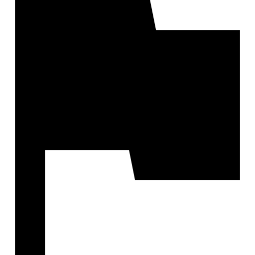 - `<Icon group="material-design" name="waving-flag" />`
 -  - `<Icon group="material-design" name="web-server" />`
 -  - `<Icon group="material-design" name="website-with-different-sections" />`
 -  - `<Icon group="material-design" name="wifi-high-signal" />`
 - 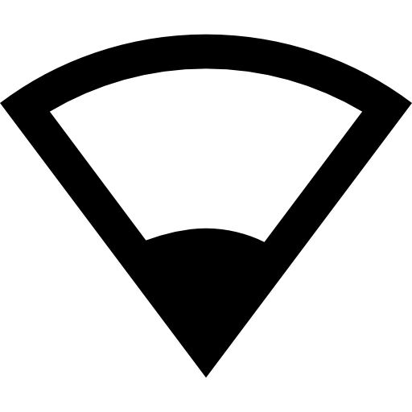 - `<Icon group="material-design" name="wifi-low-signal-with-one-bar" />`
 -  - `<Icon group="material-design" name="wifi-signal-waves" />`
 - 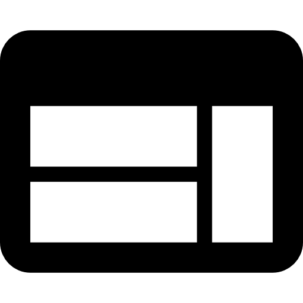 - `<Icon group="material-design" name="window-with-different-sections" />`
 -  - `<Icon group="material-design" name="work-briefcase" />`
 -  - `<Icon group="material-design" name="workspace-with-two-horizontal-windows" />`
 -  - `<Icon group="material-design" name="world-shape-public-symbol" />`
 -  - `<Icon group="material-design" name="write-email-envelope-button" />`
 -  - `<Icon group="material-design" name="youtube-logo" />`